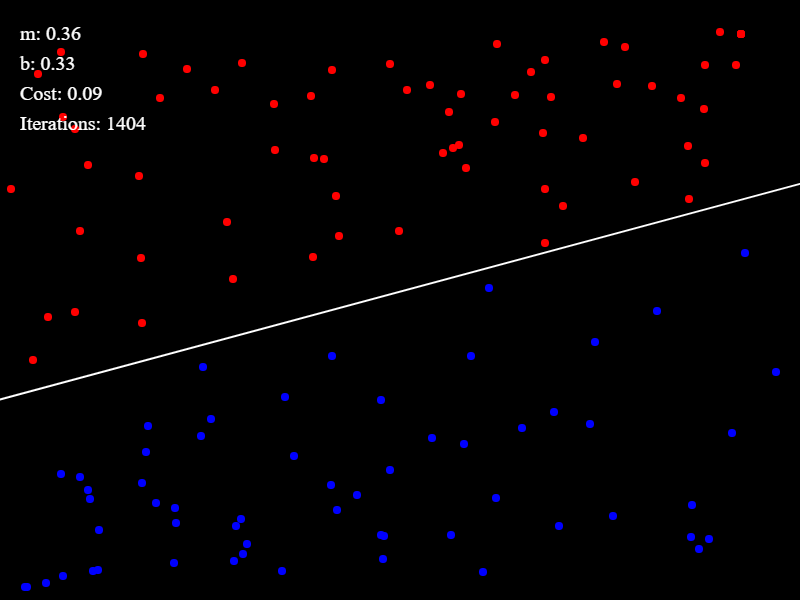
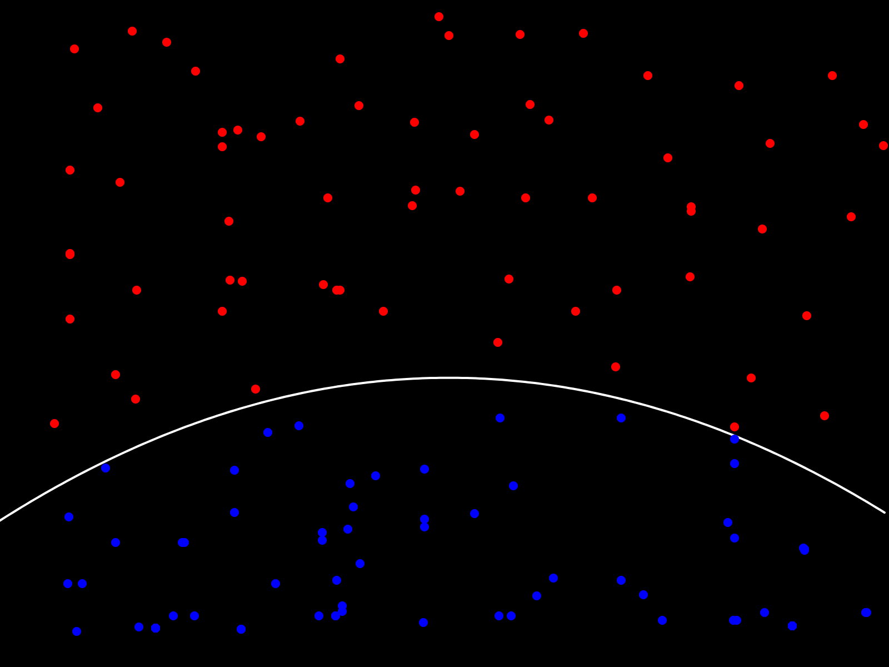

# Teach Explainable AI (XAI) with P5.js

This repository is dedicated to empowering learners to explore the fascinating realm of Explainable Artificial Intelligence (XAI) through interactive visualizations built with P5.js. Understanding how AI models make decisions is crucial for both enthusiasts and professionals alike, and with the help of P5.js, we aim to demystify complex AI concepts in an accessible and engaging manner.

Whether you're a student eager to delve into AI ethics, an educator seeking resources to teach XAI principles, or a developer looking to enhance transparency in AI applications, this repository offers a variety of resources, tutorials, and interactive examples to support your journey. This repository is organized to showcase interactive visualizations designed to facilitate learning and foster intuitive understanding of artificial intelligence (AI) models through creative coding. Each visualization simulates a lecturer guiding a class, providing hands-on demonstrations and explanations to help learners grasp the concepts behind AI algorithms in an engaging and accessible manner.
Whether you're a student eager to delve into AI ethics, an educator seeking resources to teach XAI principles, or a developer looking to enhance transparency in AI applications, this repository offers a variety of resources, tutorials, and interactive examples to support your journey.

#### What is P5.js?
p5.js is a dynamic JavaScript library tailored for creative coding endeavors. Stemming from the renowned Processing framework, known for its emphasis on creative coding, p5.js inherits its essence. Primarily designed to facilitate novice programmers in crafting interactive, graphical applications, Processing endeavors to render programming languages more accessible through visualization. What sets Processing apart is its inclusive approach, welcoming not only developers but also artists, designers, researchers, and anyone keen on exploring the art of creation.

#### What is P5.js?
p5.js is a dynamic JavaScript library tailored for creative coding endeavors. Stemming from the renowned Processing framework, known for its emphasis on creative coding, p5.js inherits its essence. Primarily designed to facilitate novice programmers in crafting interactive, graphical applications, Processing endeavors to render programming languages more accessible through visualization. What sets Processing apart is its inclusive approach, welcoming not only developers but also artists, designers, researchers, and anyone keen on exploring the art of creation.

### Quick Setup of p5.js and ml5.js
If you're familiar with [p5.js](https://p5js.org/), ml5.js has been designed to play very nicely with p5. You can use the following boilerplate code to get started:

In an index.html file, copy and paste the following and open up that file in your web browser.

```html
<h2>Example of what an index.html file should look like</h2>

<pre>
<!DOCTYPE html>
<html lang="en">
  <head>
    <title>Getting Started with ml5.js</title>
    <meta name="viewport" content="width=device-width, initial-scale=1.0">
    <!-- p5 -->
    <script src="https://cdnjs.cloudflare.com/ajax/libs/p5.js/1.0.0/p5.min.js"></script>
    <script src="https://cdnjs.cloudflare.com/ajax/libs/p5.js/1.0.0/addons/p5.sound.min.js"></script>
    <!-- ml5 -->
    <script src="https://unpkg.com/ml5@latest/dist/ml5.min.js"></script>
  </head>

  <body>
    <main>
    </main>
    <script src="sketch.js"></script>
  </body>
</html>
</pre>
```

## Understanding Linear vs. Non-linear Gradient Descent
As a teacher looking to elucidate the nuances of gradient descent to your students, leveraging interactive visualizations can greatly enhance comprehension. In the realm of Explainable AI (XAI), P5.js provides a powerful platform to demonstrate key concepts such as linear and non-linear gradient descent.

### Linear Gradient Descent Vs Non-linear Gradient Descent
Linear gradient descent refers to the optimization process used to minimize the error of a linear model by adjusting parameters iteratively. In our P5.js visualization, students can observe a smooth, straightforward descent along a linear path towards the optimal solution. Emphasize to your students that linear gradient descent is efficient for linear models but may encounter limitations when dealing with more complex, non-linear data distributions.

On the other hand, non-linear gradient descent tackles optimization in scenarios where the relationship between inputs and outputs is non-linear. In our P5.js visualization, students will witness a more intricate descent pattern, navigating through valleys and peaks in the error landscape. Encourage students to recognize that non-linear gradient descent requires more sophisticated strategies and may be prone to getting stuck in local minima.

#### Brief Explanation of Loss Function (Cost Function)
**Loss Function (Cost Function):**
In machine learning, the loss function measures how well the model's predictions match the actual labels in the training data. It quantifies the difference between the predicted values and the actual values. The goal of training a machine learning model is to minimize this loss function.

**Mean Squared Error (MSE):**
The mean squared error is a common loss function used in regression problems. It calculates the average of the squared differences between the predicted values and the actual values. The formula for MSE is:

MSE = 1/n * ∑(yi - ŷi)^2

where:
- n is the number of data points.
- yi is the actual label for the ith data point.
- ŷi is the predicted value for the ith data point.

**Role of Cost in Gradient Descent:**
In gradient descent optimization, the algorithm iteratively updates the model parameters (in this case, the coefficients of the quadratic function) to minimize the cost function. The gradients of the cost function with respect to the model parameters are used to update the parameters in the direction that reduces the cost.


#### Brief explanation of the Iteration Counter
In the context of gradient descent optimization, "iterations" refers to the number of times the optimization algorithm updates the model parameters in order to minimize the loss function and improve the model's performance. Each iteration allows the model to better fit the training data and reduce the discrepancy between the predicted and actual values.

### Teaching Approach
Utilize the interactive P5.js visualizations in this repository to guide students through the differences between linear and non-linear gradient descent. Encourage exploration and experimentation, allowing students to manipulate parameters and observe how the optimization process unfolds in real-time. By providing hands-on experiences with these concepts, students can develop a deeper understanding of gradient descent algorithms and their implications in machine learning and AI.

### Key Takeaways
- Linear gradient descent follows a straightforward path towards optimization, suitable for linear models.
- Non-linear gradient descent navigates through complex error landscapes, requiring more advanced strategies.
- Interactive P5.js visualizations facilitate experiential learning, enabling students to grasp the intricacies of gradient descent algorithms effectively.
- Empower your students to comprehend the intricacies of gradient descent algorithms using the resources and visualizations provided in this repository. Foster an environment of exploration and discovery, where students can gain practical insights into the workings of AI optimization techniques.
  
Linear Gradient Descent            |  Non-Linear Gradient Descent
:-------------------------:|:-------------------------:
  |  


## Feature Extraction Regression \& Image Classification
In the realm of machine learning, feature extraction plays a pivotal role in understanding and extracting meaningful patterns from data. Feature extraction regression, a technique offered by libraries like ml5.js, allows us to harness pre-trained models to extract features from data and perform regression tasks and distinguish between different images or objects. Feature extraction regression involves utilizing pre-trained models, such as MobileNet, to extract features from input data, which are then used as input to a regression model. This approach enables us to leverage the learned representations of the pre-trained model to perform regression tasks on various types of data, including images and video streams.

#### Getting Started:
To explore feature extraction regression with P5.js, we'll utilize the ml5.js library, which provides an intuitive interface for integrating machine learning models into creative projects. Through a series of interactive visualizations and hands-on exercises, students can gain a deeper understanding of feature extraction regression and its applications.

#### Practical Applications:
- **Image Regression**: Use feature extraction regression to predict numerical values based on features extracted from images captured by a webcam or uploaded from a file. 
- **Video Stream Regression**: Perform real-time regression tasks on video streams by extracting features from each frame using pre-trained models. 
- **Interactive Learning**: Engage students with interactive sliders and buttons to add examples, train models, and visualize regression results in real-time.

#### Teaching Approach:
Utilize the provided P5.js sketches and ml5.js documentation to guide students through the process of feature extraction regression. Encourage exploration and experimentation, allowing students to manipulate parameters and observe how feature extraction enhances regression tasks.

#### Key Concepts to Cover:
- **Model Initialization**: Initialize feature extraction regression models using pre-trained models such as MobileNet.
- **Data Collection**: Collect training data by capturing images or video frames and associating them with corresponding numerical values.
- **Training Process**: Train the regression model using collected data and monitor the training progress to ensure optimal performance.
- **Visualization**: Visualize regression results using P5.js to provide insights into the model's predictions and performance.

## Two Models: Feature Extraction Regression and Image Classification
When exploring the provided code examples, it's essential to recognize the distinct tasks and functionalities they represent:

- **Feature Extraction Regression**: In the first code example, the focus is on performing regression tasks by extracting features from video frames using the MobileNet model. This approach predicts numerical values based on the extracted features, enabling tasks such as image regression or real-time video stream regression.

- **Image Classification with MobileNet**: Conversely, the second code example revolves around image classification using the MobileNet model. Here, the model categorizes images into predefined classes, such as "happy" or "sad," allowing users to train and save the model for later use.

By understanding these differences, students can grasp the diverse applications and functionalities offered by feature extraction regression and image classification techniques, empowering them to choose the most suitable approach for their projects.

Feature Extraction Regression (non-discrete classification)           |  Image Classification (discrete classification)
:-------------------------:|:-------------------------:
  |  

#### Next Steps:
Encourage students to explore additional datasets, experiment with different pre-trained models, and integrate feature extraction regression into their own creative projects. By mastering feature extraction regression techniques, students can unlock a wide range of possibilities for applying machine learning in their work.


### Exploring Neural Networks with Interactive Visualizations
Neural networks are powerful computational models inspired by the human brain's interconnected neurons. They excel at learning complex patterns and relationships from data, making them fundamental to various machine learning tasks. In this section, we'll delve into neural networks through interactive visualizations using P5.js, allowing you to gain insights into their inner workings and how weights affect their behavior.

<p align="center">
  
</p>
<p align="center">
  Imagine sending 3 features of an animal through a neural network and it predicts how likely it is a dog or cat.
</p>

1. **Model Initialization**: The code initializes a neural network model using ml5.js, defining its inputs, outputs, and task (classification). This step sets the stage for training the model to classify data points based on their features.

2. **Data Collection**: Through mouse interactions, you can collect training data points by clicking on the canvas. Each data point is associated with a target label ('C', 'D', or 'E'), representing different classes. This process simulates the collection of labeled data for training the neural network.

3. **Training the Model**: Once the training data is collected, you can initiate the training process by pressing the 't' key. The model undergoes training epochs, adjusting its internal weights to minimize prediction errors and improve classification accuracy.

4. **Prediction and Visualization**: After training, the model enters the prediction state, where it can classify new data points based on their features. The visualizations update in real-time, showcasing the model's classification decisions and the impact of weights on its behavior.

#### Key Insights:

- **Effect of Weights**: By observing how the neural network classifies data points, you can gain insights into how its internal weights influence decision-making. Experiment with different training epochs and target labels to observe changes in the model's behavior.

- **Interactive Learning**: The interactive nature of the visualization allows for intuitive exploration of neural networks. Visual feedback, such as the sound generated based on classification results, enhances understanding and engagement.

- **Training Dynamics**: Monitor the training process through console logs, observing the training epochs and loss values. Understanding the dynamics of model training provides valuable insights into the optimization process and convergence behavior.

#### Next Steps:

Explore further by adjusting parameters such as the number of training epochs, the choice of activation functions, or the network architecture. Additionally, consider extending the visualization to visualize activation functions, decision boundaries, or training dynamics in more detail.
