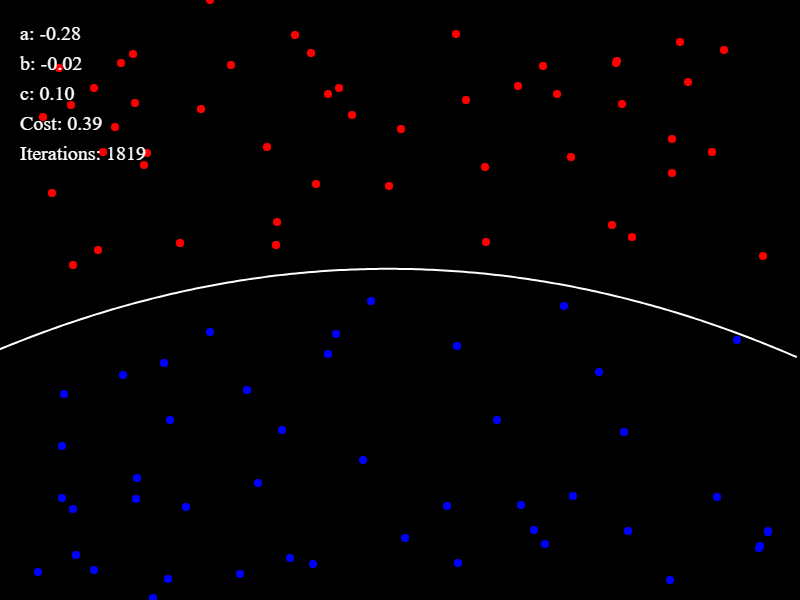

# Teach Explainable AI (XAI) with P5.js

This repository is dedicated to empowering learners to explore the fascinating realm of Explainable Artificial Intelligence (XAI) through interactive visualizations built with P5.js. Understanding how AI models make decisions is crucial for both enthusiasts and professionals alike, and with the help of P5.js, we aim to demystify complex AI concepts in an accessible and engaging manner.

Whether you're a student eager to delve into AI ethics, an educator seeking resources to teach XAI principles, or a developer looking to enhance transparency in AI applications, this repository offers a variety of resources, tutorials, and interactive examples to support your journey. This repository is organized to showcase interactive visualizations designed to facilitate learning and foster intuitive understanding of artificial intelligence (AI) models through creative coding. Each visualization simulates a lecturer guiding a class, providing hands-on demonstrations and explanations to help learners grasp the concepts behind AI algorithms in an engaging and accessible manner.
Whether you're a student eager to delve into AI ethics, an educator seeking resources to teach XAI principles, or a developer looking to enhance transparency in AI applications, this repository offers a variety of resources, tutorials, and interactive examples to support your journey.

## Understanding Linear vs. Non-linear Gradient Descent
As a teacher looking to elucidate the nuances of gradient descent to your students, leveraging interactive visualizations can greatly enhance comprehension. In the realm of Explainable AI (XAI), P5.js provides a powerful platform to demonstrate key concepts such as linear and non-linear gradient descent.

### Linear Gradient Descent Vs Non-linear Gradient Descent
Linear gradient descent refers to the optimization process used to minimize the error of a linear model by adjusting parameters iteratively. In our P5.js visualization, students can observe a smooth, straightforward descent along a linear path towards the optimal solution. Emphasize to your students that linear gradient descent is efficient for linear models but may encounter limitations when dealing with more complex, non-linear data distributions.

On the other hand, non-linear gradient descent tackles optimization in scenarios where the relationship between inputs and outputs is non-linear. In our P5.js visualization, students will witness a more intricate descent pattern, navigating through valleys and peaks in the error landscape. Encourage students to recognize that non-linear gradient descent requires more sophisticated strategies and may be prone to getting stuck in local minima.

### Teaching Approach
Utilize the interactive P5.js visualizations in this repository to guide students through the differences between linear and non-linear gradient descent. Encourage exploration and experimentation, allowing students to manipulate parameters and observe how the optimization process unfolds in real-time. By providing hands-on experiences with these concepts, students can develop a deeper understanding of gradient descent algorithms and their implications in machine learning and AI.

### Key Takeaways
- Linear gradient descent follows a straightforward path towards optimization, suitable for linear models.
- Non-linear gradient descent navigates through complex error landscapes, requiring more advanced strategies.
- Interactive P5.js visualizations facilitate experiential learning, enabling students to grasp the intricacies of gradient descent algorithms effectively.
- Empower your students to comprehend the intricacies of gradient descent algorithms using the resources and visualizations provided in this repository. Foster an environment of exploration and discovery, where students can gain practical insights into the workings of AI optimization techniques.
  
Linear Gradient Descent            |  Non-Linear Gradient Descent
:-------------------------:|:-------------------------:
  |  

## Feature Extraction Regression
In the realm of machine learning, feature extraction plays a pivotal role in understanding and extracting meaningful patterns from data. Feature extraction regression, a technique offered by libraries like ml5.js, allows us to harness pre-trained models to extract features from data and perform regression tasks.

#### What is Feature Extraction Regression?
Feature extraction regression involves utilizing pre-trained models, such as MobileNet, to extract features from input data, which are then used as input to a regression model. This approach enables us to leverage the learned representations of the pre-trained model to perform regression tasks on various types of data, including images and video streams.

#### Getting Started:
To explore feature extraction regression with P5.js, we'll utilize the ml5.js library, which provides an intuitive interface for integrating machine learning models into creative projects. Through a series of interactive visualizations and hands-on exercises, students can gain a deeper understanding of feature extraction regression and its applications.

#### Practical Applications:
- **Image Regression**: Use feature extraction regression to predict numerical values based on features extracted from images captured by a webcam or uploaded from a file. 
- **Video Stream Regression**: Perform real-time regression tasks on video streams by extracting features from each frame using pre-trained models. 
- **Interactive Learning**: Engage students with interactive sliders and buttons to add examples, train models, and visualize regression results in real-time.

#### Teaching Approach:
Utilize the provided P5.js sketches and ml5.js documentation to guide students through the process of feature extraction regression. Encourage exploration and experimentation, allowing students to manipulate parameters and observe how feature extraction enhances regression tasks.

#### Key Concepts to Cover:
- **Model Initialization**: Initialize feature extraction regression models using pre-trained models such as MobileNet.
- **Data Collection**: Collect training data by capturing images or video frames and associating them with corresponding numerical values.
- **Training Process**: Train the regression model using collected data and monitor the training progress to ensure optimal performance.
- **Visualization**: Visualize regression results using P5.js to provide insights into the model's predictions and performance.

#### Next Steps:
Encourage students to explore additional datasets, experiment with different pre-trained models, and integrate feature extraction regression into their own creative projects. By mastering feature extraction regression techniques, students can unlock a wide range of possibilities for applying machine learning in their work.
